# Outbound Lead Agent

> AI-powered B2B lead research agent with human-in-the-loop approval. Built with LangGraph, FastAPI, and Next.js.


---

## Demo

**Live:** [https://agent.hussainflow.com/](https://agent.hussainflow.com/)

Paste a company URL and Outbound Lead Agent researches the company end-to-end: it scrapes the website, searches the public web for buying signals, looks up the primary decision-maker, scores the company against your Ideal Customer Profile, and drafts a personalised cold-outreach email. Nothing is sent until you click *Approve* — the pipeline pauses on a human-in-the-loop gate so you stay in control of every email that leaves the system.

> **Note:** A research run typically takes 60–90 seconds. The agent waits on real web search and external lookups, so the first request after a cold start can be a little slower while connections warm up.

---

## What it does

**Company research.** A LangChain ReAct agent (GPT-4o-mini) drives a `web_search` (Tavily) + `scrape` (httpx + BeautifulSoup) tool loop to build a structured profile — name, tagline, HQ, employee estimate, funding stage, products, notable customers, and the source URLs every claim came from. A post-parse verifier wipes any field that can't be backed by a source URL containing the company's own domain, so the dossier never inherits facts from a similarly-named company in another industry.

**Decision-maker contact.** A second agent calls Hunter.io's domain search to find the most senior reachable contact, returning name, title, email, LinkedIn, and a confidence score. When Hunter has nothing for the domain the contact is left null and the email-send branch downgrades to `no_contact` rather than guessing an address.

**Buying-signal detection.** A third agent runs targeted searches for funding, hiring, product launches, leadership changes, and partnerships. The output is filtered with a strict domain-substring rule: every signal must cite a source URL whose host contains the company's own domain. If the model emits a plausible-but-off-domain story it is dropped before reaching the dossier.

**ICP-aware fit scoring.** You define your Ideal Customer Profile in Settings — target industries, funding stages, geographies, must-have signals, red flags, and your value proposition. `dossier_writer` switches into ICP mode and returns a 1–10 score with a pipe-separated rationale (`8/10 — Industry: B2B SaaS ✅ | Stage: Series C ✅ | Geography: US ✅ | Signals: hiring sales ✅, funding ❌ not found | Red flags: none ✅`) so the score is auditable, not a black box. Without an ICP the agent falls back to a generic "found / missing" rubric and prompts you to configure one.

**Email drafting.** The same node writes a 3–4 sentence cold email that references the contact's actual name and title, at least one verified buying signal, and a paraphrased angle from your value proposition. Placeholder strings like `[your product]` are explicitly forbidden in the prompt.

**Human-in-the-loop approval.** After the dossier is drafted, the LangGraph node `await_approval` calls `interrupt()`, durably suspending the run on the checkpointer. The UI shows the full dossier and email; *Approve* resumes with `Command(resume=True)` and `send_email` ships via SendGrid; *Reject* resumes with `False` and the run finishes without delivery. Resume is durable across process restarts when Postgres is configured.

**Anti-hallucination throughout.** Every research claim ties back to a source URL. Domain-verification runs on company profiles and on signals. Tool-call schemas are explicit. JSON outputs are parsed with a fence-stripping primitive that rejects unstructured prose. Tests assert these guards.

**Prompt-injection boundary.** Scraped pages and search snippets are untrusted external data. Agent prompts may quote or summarize that content as evidence, but page text must never be treated as system, developer, or tool instructions. Future RAG work must preserve the same trusted-user-context versus untrusted-source-content boundary.

---

## Architecture

```mermaid
flowchart LR
    User([User]) -->|paste URL| Web[Next.js 14 frontend<br/>Vercel]
    Web -->|POST /api/qualify| API[FastAPI backend<br/>Railway]
    API --> Graph[(LangGraph StateGraph<br/>checkpointer: InMemory or Postgres)]
    Graph --> R[company_researcher]
    R --> C[contact_finder]
    C --> S[signal_detector]
    S --> D[dossier_writer]
    D --> A[await_approval &#9208;]
    A -->|approve / reject| E[send_email]
    E -->|optional| SG[SendGrid]
    Graph -.optional.-> LF[Langfuse traces]
```



**Frontend.** Next.js 14 App Router (`/`, `/settings`, `/leads/[threadId]`). The qualify form posts a URL plus the locally-stored ICP, then routes the user to the dossier page where TanStack Query hydrates from the cache the form just seeded. Approve/Reject buttons fire mutations against `/api/leads/{thread_id}/approve` or `/reject`.

**Backend.** A FastAPI app (`src/saas_lead_agent/api/main.py`) exposes three POST endpoints, holds a singleton compiled LangGraph in module scope, and mounts a Chainlit chat UI at `/chainlit` for an alternative interaction surface. Current responses intentionally preserve the flat frontend contract; the schema package defines a planned `APIResponse`/`APIError` envelope for a future versioned `/api/v1` transition.

**LangGraph pipeline.** `START → company_researcher → contact_finder → signal_detector → dossier_writer → await_approval → send_email → END`. Sequential rather than parallel — see *Design decisions*.

**Persistence.** When `POSTGRES_URL` is set the FastAPI lifespan swaps the InMemorySaver for `AsyncPostgresSaver` and runs idempotent DDL on boot. A graph paused at `await_approval` survives a redeploy; the user can come back hours later and approve.

**Observability.** When `LANGFUSE_PUBLIC_KEY` is set a singleton `CallbackHandler` is attached at the FastAPI route level and LangChain propagates it through every nested Runnable, so every node's tokens, latency, and tool calls land in Langfuse with no node-level changes.

---

## Tech stack

| Layer | Technology | Purpose |
| --- | --- | --- |
| Frontend | Next.js 14, React 18, TypeScript, Tailwind CSS, shadcn/ui, TanStack Query v5, react-hook-form + Zod | Server-rendered UI; client-side cache; form validation |
| Backend | Python 3.11, FastAPI 0.115, Pydantic v2, uv | HTTP API, request validation, dependency management |
| Agents | LangGraph 1.1, LangChain 1.1, GPT-4o-mini (`langchain-openai`) | StateGraph orchestration; ReAct tool-calling loops |
| Research tools | Tavily (web search), Hunter.io (email finder), httpx + BeautifulSoup (scrape) | External lookups grounded in real sources |
| Persistence | Supabase / Postgres via `AsyncPostgresSaver` (psycopg3) | Durable HITL resume; falls back to InMemorySaver |
| Observability | Langfuse v3 | Optional per-node tracing; None-safe fallback |
| Email | SendGrid (sync SDK in `asyncio.to_thread`) | Optional outbound delivery; explicit stub fallback for dev |
| Alt UI | Chainlit v2 (mounted at `/chainlit`) | Chat-style interface sharing the same graph instance |
| Deployment | Railway (backend), Vercel (frontend), Docker (multi-stage, non-root, runs locally via `docker compose`) | Production hosting |
| Quality | ruff, mypy (strict), pytest, pytest-asyncio | 170+ tests, ruff + mypy clean on every change |

---

## How it works

1. **Paste a company URL** on the home page (`https://stripe.com`, `https://linear.app`, anything `http(s)://`).
2. **The agent pipeline runs** for 60–90 seconds — researcher scrapes and searches, contact_finder hits Hunter, signal_detector runs five targeted searches, dossier_writer scores and drafts.
3. **The dossier renders** with company profile, decision-maker, signals, fit score with `✅/❌` rationale, and the drafted email.
4. **Set your ICP in Settings** (industries, stages, geographies, must-have signals, red flags, value proposition) for a personalised score; the page in-line warns if you haven't.
5. **Review the email** — recipient, subject, body, all visible before send.
6. **Approve or Reject.** Approve delivers via SendGrid (or records an explicit `stubbed` result in dev); Reject closes the thread without delivery.

---

## Local development

### Prerequisites

- Python 3.11 (pinned, `requires-python = ">=3.11,<3.12"`)
- Node.js 18+
- [uv](https://github.com/astral-sh/uv) (the project mandates uv — never pip)
- git

### Setup

```bash
git clone https://github.com/Hussain-memon06/saas-lead-agent.git
cd saas-lead-agent
cp .env.example .env
# fill in OPENAI_API_KEY, TAVILY_API_KEY, HUNTER_API_KEY at minimum
```

### Run the backend

```bash
uv sync
uv run uvicorn src.saas_lead_agent.api.main:app --reload --port 8080 --timeout-keep-alive 120
```

Backend listens on `http://localhost:8080`. The Chainlit UI is at `/chainlit`, the OpenAPI docs at `/docs`.

### Run the frontend

```bash
cd frontend
npm install
npm run dev
```

Open `http://localhost:3000`. Next.js proxies `/api/*` to `localhost:8080` via a rewrite, so the browser sees a single origin and you don't need CORS during dev.

### Required API keys

| Key | Required | Purpose | Free tier? |
| --- | --- | --- | --- |
| `OPENAI_API_KEY` | Yes | GPT-4o-mini for every agent | No |
| `TAVILY_API_KEY` | Yes | Web search tool used by researcher and signal detector | Yes (1 000 req/mo) |
| `HUNTER_API_KEY` | Yes | Domain search for the decision-maker email | Yes (25 req/mo) |
| `SENDGRID_STUB_ENABLED` | No | Explicit dev/test stub mode; returns `stubbed`, not `sent` | — |
| `SENDGRID_API_KEY` | No | Real email delivery; required when stub mode is disabled and approval should send | Yes (100 emails/day) |
| `SENDGRID_FROM_EMAIL` | No | Required only when SendGrid is configured | — |
| `POSTGRES_URL` | No | Durable HITL resume; InMemorySaver fallback when unset | Yes (Supabase free tier) |
| `LANGFUSE_PUBLIC_KEY` | No | Per-node tracing; tracing disabled when unset | Yes (50k events/mo) |
| `LANGFUSE_SECRET_KEY` | No | Paired with the public key | Yes |

### Tests, lint, types

```bash
uv run pytest         # 172 passing, 6 skipped without POSTGRES_URL
uv run ruff check
uv run mypy src/
```

---

## Deployment

**Frontend (Vercel).** Connect the repo, set the project root to `frontend/`, and add `NEXT_PUBLIC_API_BASE_URL` pointing at the Railway URL. `frontend/vercel.json` already pins `buildCommand` and `outputDirectory`.

**Backend (Railway).** Connect the repo and Railway picks up the multi-stage `Dockerfile` automatically. Add every env var from the table above to the Railway *Variables* tab. The container honours `$PORT` so Railway can route traffic without code changes.

**Local full-stack (Docker).** `docker compose up --build` boots Postgres + a one-shot migration step + the FastAPI app on port 8080 — useful for testing a deploy-shaped run on your own machine.

For a step-by-step Cloud Run runbook (alternative target with Secret Manager), see [`DEPLOYMENT.md`](./DEPLOYMENT.md).

---

## Project structure

```
saas-lead-agent/
├── src/saas_lead_agent/
│   ├── agents/         # company_researcher, contact_finder, signal_detector,
│   │                   # dossier_writer, await_approval, send_email
│   ├── tools/          # web_search (Tavily), scraper, hunter
│   ├── memory/         # checkpointer (Postgres), langfuse_handler
│   ├── api/            # main (FastAPI factory), routes, schemas
│   ├── ui/             # Chainlit chat app
│   ├── email/          # SendGrid client
│   ├── graph.py        # StateGraph assembly
│   └── state.py        # LeadState TypedDict
├── frontend/           # Next.js 14 App Router UI
├── tests/              # 170+ pytest tests, async-mode
├── specs/              # phase plans + ADRs (decisions.md)
├── Dockerfile          # multi-stage, non-root, ${PORT}-aware
├── docker-compose.yml  # postgres + migrate + app
└── DEPLOYMENT.md       # Cloud Run runbook
```

---

## Design decisions

A few of the more interesting calls (the full list with rationale lives in [`decisions.md`](./decisions.md)).

**Sequential research chain, not parallel.** Earlier versions ran `company_researcher`, `contact_finder`, and `signal_detector` in parallel. Each subagent fires 3–6 chat completions and several tool calls; three concurrent ones routinely tripped Tier 1 OpenAI rate limits and produced half-populated dossiers. Switching to a serial chain costs ~30 seconds of wall-clock time but eliminates 429 mid-run failures, and the human-approval gate dominates total time-to-decision anyway.

**Domain-verification on every research output.** Two LLM-driven nodes (researcher and signal detector) post-process their JSON to drop any field or signal whose source URL doesn't contain the company's own domain. Name collisions are common in startup-land — you don't want a Stripe dossier inheriting facts from a different "Stripe". The guards run mechanically after parsing; the prompt also explains the rule, but the code enforces it.

**Optional dependencies must be None-safe.** SendGrid, Postgres, and Langfuse are all optional. If `POSTGRES_URL` is unset the lifespan falls back to `InMemorySaver`. If `SENDGRID_API_KEY` is unset, `send_email` returns `send_result="stubbed"` only when `SENDGRID_STUB_ENABLED=true`; otherwise it fails closed instead of reporting fake delivery. If `LANGFUSE_PUBLIC_KEY` is unset the callback handler is `None` and no callbacks are attached. Tests rely on these branches; deploys can adopt providers incrementally without rewrites.

**Human-in-the-loop via `interrupt()`, not a status field.** `await_approval` calls LangGraph's `interrupt()`, which durably suspends the graph on the checkpointer and returns control to the API. Approve/reject is a `graph.ainvoke(Command(resume=<bool>), config)` — not a separate "approved=true, please run send_email" job that the worker has to discover. Resume is exactly-once and survives process restarts when Postgres is configured.

**Chainlit shares the graph instance with the REST routes.** Rather than the chat UI making loopback HTTP calls into its own backend, the Chainlit app imports `_routes._graph` and calls `.ainvoke()` directly. One source of truth for HITL state, no localhost URL hardcoding, identical behaviour across the chat and form interfaces.

**Two-mode dossier prompt.** The same node renders different system prompts depending on whether `state.icp_context` is populated. ICP mode embeds the user's rubric and enforces a pipe-separated, ✅/❌ explanation format the UI parses for display. Generic mode emits a "found / missing" line and nudges the user toward Settings. Both modes ban placeholder strings (`[your product]`, `{name}`) in the email body so output is ready to send.

---

## Portfolio context

Built by **Hussain Memon** as a portfolio project to demonstrate agentic AI engineering, FastAPI backend design, and full-stack product thinking. Background in business with ML/AI specialisations from edX and Coursera. Available for freelance work on Upwork.

The codebase is intentionally production-shaped — multi-stage Docker, non-root containers, durable HITL resume, optional-by-default observability, 170+ tests, ADR-driven decisions — rather than a notebook demo. Every claim in this README is verifiable in the code and the commit history.

---

## License

MIT — see [`LICENSE`](./LICENSE) (or use this README's licence header until a `LICENSE` file lands).
